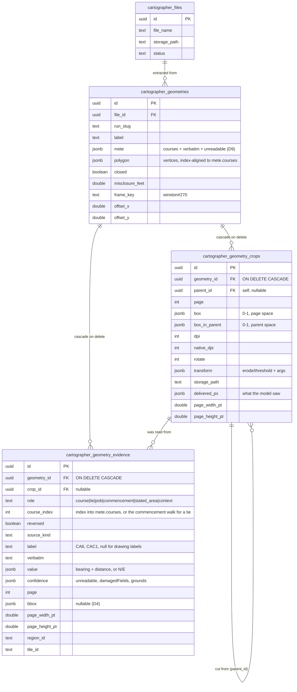
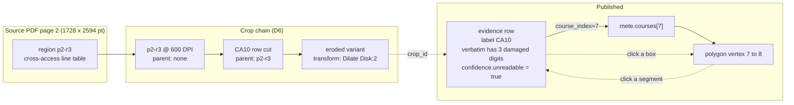

# Cartographer — evidence and crops for an extracted geometry

**Status:** Draft v2
**Date:** 2026-09-23
**Repos touched:** `cartographer` (runbook: transcribe/crop/tile contracts, a new `evidence.json`, `publish.ts`; a new per-geometry route in the app), `substation` (one migration — two new tables, plus `image/jpeg` on the `cartographer-files` bucket)
**Repos NOT touched:** `bureau`, `cityhall`, `conductor`/`conductor2`, `navalbase` (prior art only — see §9.1)
**Prod:** Supabase project **Noetic App** (`mgxqsrjutswbciyrltwd`), bucket `cartographer-files`
**Predecessors:** [`../DESIGN-SPEC.md`](../DESIGN-SPEC.md) (winston#266) — the runbook this instruments · [`../../geometry-placement/DESIGN-SPEC.md`](../../geometry-placement/DESIGN-SPEC.md) (winston#270) — frames and placement evidence

**Companion:** [`entity-model.html`](entity-model.html) — the visual data model (entities · the crop chain · the bidirectional trace · cascade behaviour · what a box means)

> **Revision note (v2, 2026-09-23, pre-implementation review).** Every codebase claim in v1 was re-verified against `cartographer@2678672` and the run folder; all hold. Four corrections, none changing the design: (1) the `cartographer-files` bucket allows only `application/pdf` and `image/png` (`20260918000000_cartographer_files.sql`), so the `.jpg` crop uploads in §7 would be rejected — the migration in §6 now also adds `image/jpeg`; (2) a tie is a real course in the commencement walk (`pob.commencement.ties[]`, two on the cross-access easement, one of them damaged) and had no way to say which tie it was — the `course_index` constraint now admits `role = 'tie'`, indexing the commencement walk; (3) D3 promised page dimensions on every row that carries a box but the crops table had none — `page_width_pt` / `page_height_pt` added to crops; (4) D8 now states that a cited crop uploads with its ancestors, since the breadcrumb (§9.3) swaps between them. Also noted: `assemble.ts` already requires `verbatim` and carries `unreadable` into `artifact.json`, so Phase 0 is a `publish.ts` change plus the badge. Q6/Q7 renumbered into order.

> A published figure is currently unfalsifiable. It carries bearings and distances with no record of where on the page they were read, what the ink actually looked like, or how much of the reading was a guess. This adds that record, and a view that draws it back onto the source PDF.

---

## 1. Problem

### 1.1 The published row is a dead end

`cartographer_geometries` stores the courses as `{bearing, distance, label}` and nothing else. Verified by reading the live row for the car-wash plat's cross-access easement (`cartographer_geometries.id = 0d02fde1-2658-4ba4-8060-4bc4109a3f53`, file `bebccffa-baaa-444e-a800-2b760f90ef78`, run `car-wash-2024178771-run3`): 21 courses, each exactly those three fields; `polygon` is 21 bare `{x,y}` points with no attribution back to the course that produced them.

Two hand-offs drop the evidence:

| Stage | What is dropped |
|---|---|
| `assemble.ts` → `artifact.json` | the per-course `note` (the forensic grounds for every reconstructed digit), the `marginal` flag, and the link back to the region the course was read from |
| `publish.ts:92-98` → the database | `verbatim` and `unreadable` — the map keeps only `bearing`, `distance` and `label` |

(`assemble.ts` itself already requires `verbatim` and carries `unreadable` through to `artifact.json` — its zod schema strips only the fields it does not declare. So the second hand-off is the whole of the Phase 0 fix.)

The comment at `publish.ts:89` says the label "is the provenance of the course, and without it a stored figure cannot be traced back to the table row it was read from." That is the right instinct, and a row id is as far as it goes: it names a row in a table that isn't stored either.

### 1.2 The reading is much less certain than the row admits

That same easement: **11 of its 21 courses have at least one digit that the scan destroyed**, and the published row says nothing about it. From `transcribe/p2-r3.json` and `p2-r4.json` in the run folder:

| Row | As printed | Value used |
|---|---|---|
| CA6 | `S 32°34'50" W 31.0?'` | 31.08 |
| CA9 | `S 05°4?'25" W 26.9?'` | 5°48'25", 26.98 |
| CA10 | `N ??°0?'19" W 36.09'` | **88°08'19"** — three guessed digits |
| CA11 | `N 05°4?'25" E 35.01'` | 5°48'25" |
| CA14 | `N 32°34'24" E 16.?1'` | 16.81 |
| CA17 (tie) | `S 32°34'51" W 11.9?'` | 11.98 |
| CAC1, CAC4, CAC5, CAC7, CAC8, CAC9 | one to four damaged fields each | see the run's `hitl/readout.md` §2 |

The transcriber's notes are candid about the grounds — the source is a 1-bit CCITT scan at 600 DPI, crops were taken at 600 DPI, so **there is no resolution headroom**; level-stretching is meaningless on a bilevel image and erosion reopened at most a pinhole. Most guesses rest on glyph silhouette alone, and nearly every one is an `8`, which is what a filled-in `6`, `9` or `3` also looks like. None of that reaches anyone looking at `/processed`.

### 1.3 Crops are currently unrecoverable

- `crop.ts:113` prints its record — `{regionId, page, dpi, rotate, pixels, path}` — **to stdout only**. No sidecar is written, so which crop produced a reading survives only in the agent transcript. The record also omits the normalized box, keeping only pixels.
- The crops that actually decided the damaged digits were never made by `crop.ts` at all. Run 3 left **456 files under `crops/_scratch/`** — hand-cuts the workers made with `magick -crop` because a 600-DPI crop still exceeds what the harness shows a model, plus the eroded and threshold-tested variants. Nothing records what box any of them covers. This is already on the run's own `tool-bugs.md` as "a `crop.ts` option to emit a ≤1500 px piece grid would save each worker re-inventing this".

### 1.4 `tile.ts remap` ignores rotation

`remapToPage` (`runbooks/extract-geometry/scripts/lib/page.ts:97`) is plain linear math on the tile box and never reads the `rotate` stored in the manifest. A worker who tiles at `rotate=270` — which this plat needs, since its drawing is printed sideways — and reports boxes in the rotated frame gets silently wrong page boxes. Run 3's worker avoided it by tiling at `rotate=0` and converting by hand, which is exactly the arithmetic `remap` exists to prevent. **Every box this spec stores would be wrong until this is fixed**, so it is a prerequisite, not a follow-up.

### 1.5 What already exists and can be reused

The pipeline is closer than it looks:

| Piece | Where | Note |
|---|---|---|
| Region boxes, 0–1 normalized | `survey/page-<n>.json` `regions[].bbox` | one per table / drawing region |
| Tile boxes, 0–1 normalized | `tiles/page-<n>.json` `tiles[].box` | written by `tile.ts plan` |
| **Per-label boxes on the drawing** | `transcribe/p2-r5-t*.json` `courses[].location` | plus `alongLine` prose — this is the Lot 1 case, already captured |
| Per-course `verbatim`, `unreadable`, `marginal`, `note` | every `transcribe/*.json` | dropped downstream (§1.1) |
| `crop.ts`, `tile.ts plan`, `remapToPage` | `scripts/` | the box arithmetic, minus the rotation bug |

The drawing-tile fields (`location`, `alongLine`, `cutOff`, `distanceOnly`, `coordinateBoxes`, `markers`, `rowTags`) were invented mid-run by the orchestrator in an addendum (`transcribe/_drawing-tile-instructions.md`) because `transcribe-region.md` assumes one readable block per region and has no concept of calls printed along a drawing. That addendum is already the better contract; §5.1 promotes it.

---

## 2. Decisions

- **D1 — Evidence and crops are children of a geometry.** Both tables carry `geometry_id` with `ON DELETE CASCADE`. Deleting a figure — which is what `publish.ts` does to every prior figure of a file on republish — takes its evidence and crops with it. No orphan rows, no second lifecycle to reason about. *(Operator's call. §4.3 records what this costs; Q1 keeps it under review.)*
- **D2 — Evidence is what a worker read from a rectangle; a crop is an image a worker looked at.** They are separate tables because they have different cardinality: 21 table rows are read from one crop, and one evidence item may cite a crop that was cut from another crop.
- **D3 — Boxes are normalized doubles in unrotated page space, origin top-left.** Full statement and reasoning in §3. Every row that carries a box also carries the page's own dimensions in points, so a box can be turned back into inches without reopening the PDF.
- **D4 — A box is optional; a reading is not.** Evidence with no box is still evidence (a value inferred from the other side of a segment, say). It renders in the right rail with no highlight on the page rather than being dropped or given a made-up rectangle.
- **D5 — Every crop must be produced by a tool that records its own provenance.** `crop.ts` writes a sidecar; a new `crop.ts subcrop` replaces hand-rolled `magick -crop`; forensic transforms (erode, threshold) are recorded as named operations with their exact arguments. The prompts forbid raw `magick` cropping. This retires two `tool-bugs.md` entries at once.
- **D6 — Crops form a chain, and evidence cites the leaf.** `parent_id` walks page → region crop → cell cut → eroded variant. The UI renders the chain as a breadcrumb (§9.3).
- **D7 — Store the image the model actually saw.** The harness downsamples to roughly 1568 px on the long edge before a model sees anything (`tile.ts:34`). Uploading the full-resolution crop would show a reader something no worker ever looked at. The delivered image is both smaller and the honest artifact. The full-resolution recipe is stored alongside it (§3.4), so a re-render is always available.
- **D8 — Only crops cited by published evidence are uploaded, together with their ancestors.** A cited leaf brings its `parent_id` chain along, because the breadcrumb (§9.3) swaps between them; an uncited chain is not uploaded at all. Run 3 produced 62 MB of crops and 5.7 MB of tiles for one two-page plat. The cited subset is roughly 17 images.
- **D9 — `mete.courses` gains `verbatim` and `unreadable`, both optional.** The join is the rich path, but a course should be legible without one, and these two fields alone answer "how much of this figure was guessed". This ships first and independently (§10, Phase 0). **Optional is load-bearing: not every figure comes from metes-and-bounds strings.** A figure reconstructed from a coordinate table, a side computed to close a ring with no printed row anywhere, or geometry imported from a non-document source all yield courses with nothing printed to quote. `verbatim` absent means "not read from a printed call", which is different from `unreadable`, meaning "read, but a digit was destroyed". A consumer must treat a missing `verbatim` as normal, never as a defect. `mete` is one `jsonb` column, so there is no column-level nullability to set — the zod schema in §5.1 is the only enforcement, and it marks both fields optional.
- **D10 — The honesty boundary of winston#270 D4 holds.** A vision worker reports what it read and where it read it. Scripts compute every coordinate transform. No model is asked to convert a tile box into a page box by hand — that is what `remapToPage` is for, once §1.4 is fixed.
- **D11 — Evidence is additive and nullable.** Figures published before this exists show "no evidence recorded", never a fabricated box. The `/processed` tile is unchanged for them.
- **D12 — The per-geometry view is a new route, not a panel.** `/processed` stays a whole-file view; `/geometry/[id]` is one figure, its shape, its evidence and its source page, and it opens in a new tab so a reader can hold it beside the plat.

---

## 3. Coordinate system (how a box is defined)

This is the question the whole feature turns on, because a box is meaningless without the frame it is measured in.

### 3.1 PDF pages do not share a size

They don't even share one inside a single document. The car-wash plat, from `pdfinfo`:

| Page | MediaBox | Inches |
|---|---|---|
| 1 | `0 0 648 789.84` | 9 × 10.97 (the county clerk's recording cover sheet) |
| 2 | `0 0 1728 2594.16` | 24 × 36 (the plat itself, arch E1) |

A PDF's default user-space unit is 1/72 inch, so MediaBox numbers are points. Page size is arbitrary per page and cannot be assumed.

### 3.2 The decision: normalized doubles, `[x0, y0, x1, y1]`, each in `[0, 1]`

`x` is a fraction of page width, `y` a fraction of page height, **origin top-left, y increasing downward**, measured against the **unrotated** MediaBox.

Three properties make this the right choice:

1. **It is what the pipeline already speaks.** `survey/*.json` region boxes, the `tile.ts plan` manifest and `remapToPage` are all 0–1 normalized already. Anything else means a conversion layer and a new class of bug.
2. **It is page-size independent.** The same consumer code draws a box on the 9-inch cover sheet and the 24-inch plat. A renderer multiplies by the viewport it happens to be drawing at: `px = x * viewport.width`.
3. **It survives re-rendering.** Boxes are read at 600 DPI, displayed at whatever pdf.js picks for the container width, and may be re-rendered at a third DPI for a thumbnail. Normalized coordinates are indifferent to all of it.

### 3.3 Why not a fixed integer grid (the 0–1000 idea)

Tempting, and it is the wrong resolution for these documents. On the 36-inch page:

- one milli-unit = 36 in / 1000 = **0.036 in** ≈ 0.9 mm
- a digit glyph in these tables is roughly **0.05–0.08 in** tall

So quantizing to 1/1000 introduces error of about half a glyph — enough to make a "this exact cell" highlight point at the wrong row. On the 9-inch cover sheet the same grid is four times finer and would be fine, which is the tell: **a fixed integer grid ties precision to page size**, and that is precisely the coupling normalization exists to remove.

There is a sharper way to see it. The model's own eye is bounded by the harness's ~1568 px delivered long edge, so one delivered pixel on the 36-inch sheet is 36/1568 = **0.023 in**. A 1/1000 grid (0.036 in) is *coarser than the model's own pixel* — it would throw away information the worker actually had. To beat the delivered pixel an integer grid needs about 1/10,000, and at that point it is a double with extra steps.

Going the other way, a box derived from a 600-DPI crop whose own offset `crop.ts` recorded exactly is good to 1/600 in = 0.0017 in, or 4.6e-5 normalized. **Doubles, serialized to 6 decimal places**, cover both ends with room to spare (1e-6 of 36 in = 0.000036 in). 6 dp is a formatting convention, not a constraint.

### 3.4 Why not absolute PDF points

Correct and unambiguous, but every consumer has to fetch the page's dimensions before it can draw anything, and a thumbnail renderer has to convert anyway. The compromise this spec takes: **store normalized, and denormalize `page_width_pt` / `page_height_pt` onto every row**. A reader gets exact inches with arithmetic and no PDF parse:

```
x_points = x_normalized * page_width_pt
x_inches = x_points / 72
```

### 3.5 Rotation, stated explicitly because it silently flips things

Two traps, and both are live on this plat:

- **PDF user space is y-up from the bottom-left corner.** This spec's boxes are **y-down from the top-left**, matching image convention, which is what every crop, tile and vision worker in the pipeline already uses. A consumer converting to PDF user space must flip: `y_pdf = page_height_pt * (1 - y_normalized)`. Stated here because a silent mismatch mirrors every box vertically and still looks plausible.
- **The page's `/Rotate` entry is not the runbook's viewing rotation.** Both pages of this plat have `/Rotate 0` — the drawing is printed sideways in the scan itself. The `rotate 270` the runbook uses is a *viewing* choice made by an operator to read it. So: boxes are stored against the unrotated MediaBox, each row records the `rotation` the worker viewed at, and a viewer that displays the page rotated applies the transform at draw time. Where a page does carry a non-zero `/Rotate`, pdf.js applies it by default (`page.getViewport()` uses `page.rotate`), so the viewer must pass `rotation: 0` or compensate.

### 3.6 Invariants

`x0 < x1`, `y0 < y1`, all four clamped to `[0, 1]`. A degenerate or inverted box is a publisher bug and fails at `publish.ts`, not in the database — same posture as the placement completeness check in `20260921000000_cartographer_geometries_placement.sql`.

---

## 4. Data model

### 4.1 Entities



### 4.2 The trace, in both directions

`course_index` is the field that earns its keep. It makes the record navigable from either end:



Click segment 7 of the drawn shape and the `CA10` row lights up on the page, with the crop the worker squinted at shown below it. Click the box and segment 7 flashes. Neither direction needs a lookup the database can't serve from one index.

### 4.3 What D1 costs (consequences of geometry-scoped evidence)

Recording these plainly so an auditor can weigh them:

1. **A call used by two figures is stored twice.** R/W Dedication Area 3 walks Lot 1's frontage call in reverse (`reversed = true`); both figures get their own evidence row pointing at the same rectangle. Duplication is bounded and the rows are small.
2. **Evidence considered and rejected has no home.** The run read the split-segment pieces, the old interior lot lines, the right-of-way width dimensions and the existing recorded easements, and deliberately used none of them. Under D1 they can only be attached to a figure they were weighed for, with `role = 'context'`, or not stored. Q2 settles which.
3. **The crop chain is per figure.** Two figures read from the same table crop each get their own crop row and their own uploaded copy of the image. At D7 sizes (delivered resolution) this is tens of kilobytes, not megabytes.

---

## 5. Runbook changes

### 5.1 One schema, enforced, replacing prose

The transcription shape becomes a **zod schema in `runbooks/extract-geometry/scripts/lib/evidence.ts`**, validated by `assemble.ts` on read and by `publish.ts` before insert — the same posture `publish.ts:48` already argues for its own types ("a field that silently went missing upstream should fail here, not insert a null"). The drawing addendum's fields (`location`, `alongLine`, `cutOff`, `distanceOnly`, `coordinateBoxes`, `markers`, `rowTags`) are promoted into `transcribe-region.md` as the standard contract rather than being reinvented per run.

Per-course, a transcription carries: `label`, `verbatim`, `value`, `isChord`, `unreadable`, `marginal`, `note`, `location` (box within the crop it was read from), and `cropId`.

### 5.2 `crop.ts` records itself (D5)

- Writes `<crop>.json` beside every image: `page`, `box` (normalized **and** pixels), `dpi`, `rotate`, `parentCropId`, `transform`, and the exact argument vector.
- New `crop.ts subcrop <parentCropId> <box>` for cutting a crop out of a crop, so a worker never shells out to ImageMagick directly. Boxes reported against a subcrop resolve to page space by walking `parent_id`, in code, not by hand.
- New `crop.ts transform <cropId> <op>` for the forensic operations, recording the op and its arguments (`-morphology Dilate Disk:2`, threshold levels) as data.

### 5.3 `tile.ts remap` honours rotation (§1.4)

`remapToPage` takes the manifest's `rotate` and applies the inverse rotation to the within-tile box before scaling into page space. Unit tests at 0/90/180/270 against known fixtures. **Blocking prerequisite** for anything in §6.

### 5.4 Per-row boxes for tables, without asking for 21 of them

Asking a worker for a box per table row is 21 more chances to be wrong and a lot of tokens. Printed tables are regular, so: **the worker reports the box of the first row and the last row; `assemble.ts` interpolates the rest** from the row count. Exact for a printed table, one extra box per region, and it degrades cleanly to the region box when a worker declines. Phase 2 (§10); Phase 1 stores region-level boxes for tables and the already-captured per-label boxes for drawings.

### 5.5 `assemble.ts` emits `evidence.json`

A new run artifact beside `artifact.json`, holding the evidence items and the crop chain with every box already resolved to page space. `publish.ts` stays deliberately dumb (`publish.ts:8` — "it makes no decisions, derives nothing") and inserts what it is given.

---

## 6. Migration (substation, additive)

Ordering: crops first, since evidence references them.

```sql
CREATE TABLE public.cartographer_geometry_crops (
  id             uuid PRIMARY KEY DEFAULT gen_random_uuid(),
  geometry_id    uuid NOT NULL REFERENCES public.cartographer_geometries(id) ON DELETE CASCADE,
  parent_id      uuid REFERENCES public.cartographer_geometry_crops(id) ON DELETE CASCADE,
  page           int NOT NULL,
  box            jsonb NOT NULL,   -- [x0,y0,x1,y1], 0-1, unrotated page space, y-down (§3)
  box_in_parent  jsonb,            -- same shape, relative to parent_id; NULL at the root
  dpi            int NOT NULL,
  native_dpi     int NOT NULL,     -- lets the UI say "no headroom left"
  rotate         int NOT NULL DEFAULT 0,
  transform      jsonb,            -- {op:'erode', args:'-morphology Dilate Disk:2'}
  storage_path   text NOT NULL,
  delivered_px   jsonb NOT NULL,   -- {w,h} the model actually saw (D7)
  page_width_pt  double precision NOT NULL,  -- D3: every row with a box carries its page's size
  page_height_pt double precision NOT NULL,
  created_at     timestamptz NOT NULL DEFAULT now()
);

CREATE TABLE public.cartographer_geometry_evidence (
  id             uuid PRIMARY KEY DEFAULT gen_random_uuid(),
  geometry_id    uuid NOT NULL REFERENCES public.cartographer_geometries(id) ON DELETE CASCADE,
  crop_id        uuid REFERENCES public.cartographer_geometry_crops(id) ON DELETE SET NULL,
  role           text NOT NULL,
  course_index   int,
  reversed       boolean NOT NULL DEFAULT false,
  source_kind    text NOT NULL,
  label          text,
  verbatim       text NOT NULL,   -- an evidence row IS a reading; a computed course has no evidence row (§11 Q7)
  value          jsonb,
  confidence     jsonb NOT NULL DEFAULT '{}'::jsonb,
  page           int NOT NULL,
  bbox           jsonb,            -- nullable by D4
  page_width_pt  double precision NOT NULL,
  page_height_pt double precision NOT NULL,
  region_id      text,
  tile_id        text,
  created_at     timestamptz NOT NULL DEFAULT now(),

  CONSTRAINT cartographer_geometry_evidence_role_check
    CHECK (role IN ('course','tie','pob','commencement','stated_area','context')),
  CONSTRAINT cartographer_geometry_evidence_source_kind_check
    CHECK (source_kind IN ('region','line_table_row','curve_table_row','drawing_label',
                           'coordinate_box','marker','area_statement')),
  -- A course must say which course it is (into mete.courses); a tie must say
  -- which tie (into the figure's commencement walk, pob.commencement.ties in
  -- artifact.json). Nothing else may claim an index.
  CONSTRAINT cartographer_geometry_evidence_course_index_check
    CHECK ((role IN ('course','tie') AND course_index IS NOT NULL)
           OR (role NOT IN ('course','tie') AND course_index IS NULL))
);

CREATE INDEX cartographer_geometry_evidence_geometry_id_idx
  ON public.cartographer_geometry_evidence (geometry_id);
CREATE INDEX cartographer_geometry_evidence_course_idx
  ON public.cartographer_geometry_evidence (geometry_id, course_index);
CREATE INDEX cartographer_geometry_crops_geometry_id_idx
  ON public.cartographer_geometry_crops (geometry_id);

ALTER TABLE public.cartographer_geometry_crops    ENABLE ROW LEVEL SECURITY;
ALTER TABLE public.cartographer_geometry_evidence ENABLE ROW LEVEL SECURITY;

-- The bucket was created for PDFs and PNG thumbnails only; crops are JPEG.
UPDATE storage.buckets
   SET allowed_mime_types = ARRAY['application/pdf', 'image/png', 'image/jpeg']
 WHERE id = 'cartographer-files';
```

RLS on with no policies, service-role access only — matching `cartographer_geometries` (`20260918170000_cartographer_geometries.sql:65`).

`mete.courses` gains `verbatim` and `unreadable` (D9) with no migration; it is already `jsonb`.

The bucket update is part of the same migration: without it every crop upload in §7 fails with a MIME rejection, since `20260918000000_cartographer_files.sql` allowed only `application/pdf` and `image/png`.

---

## 7. Storage

Crops go in the existing private `cartographer-files` bucket (`src/lib/files/keys.ts:12`), under a key derived from the geometry so the cascade has an obvious sweep path:

```
<file_id>/geometry/<geometry_id>/crops/<crop_id>.jpg
```

Reads are signed per request, like `src/routes/files/[id]/open/+server.ts` already does for the source PDF. Deleting a geometry cascades the rows; the objects are swept by the same publisher that wrote them (`publish.ts` deletes a file's prior figures before inserting — it deletes their crop objects in the same step).

Bounded by D7 + D8: delivered-resolution images, cited crops only. Expect a few MB per plat against the 62 MB a run produces locally.

---

## 8. What this makes answerable

The question that prompted the spec — *"for the variable-width cross-access easement, how were the points computed? I don't see any metes and bounds strings"* — took a session with the run folder on disk to answer. After this it is three clicks: open the figure, see 11 of 21 courses badged as reconstructed, click `CA10`, and read `N ??°0?'19" W 36.09'` beside the eroded crop of the cell it came from and the note explaining why the degrees were taken as 88.

---

## 9. The view

### 9.1 Prior art

navalbase's review UI (`src/navalbase/reviewui/static/index.html`) is the shape to copy: pdf.js renders the page to one canvas, a second absolutely-positioned canvas draws boxes from 0–1 normalized coordinates, cards on the right carry a `has-bbox` class, and clicking one flashes its box while clicking a box scrolls its card into view. Its `NAVALBASE-UI-BLUEBEAM-PLAN.md` normalizes PDF-point rects to 0–1 "matching step-3 bbox format" — the same conclusion §3 reaches independently. It is vanilla JS in one file and cartographer is SvelteKit, so this is a port of the technique, not the code.

### 9.2 Route

`/geometry/[id]`, opened in a new tab from a button on the `/processed` figure tile (beside the id-copy control shipped in cartographer#23).

### 9.3 Layout

- **Left, top** — the source page via pdf.js with the box overlay. Boxes colored by `role`: course, tie/POB, and a muted `context` layer behind a toggle. An `unreadable` course is outlined in the warning color regardless of role.
- **Left, below** — the crop panel, empty until something is selected. Then: the cited crop image, its DPI against `native_dpi` (so it can say "600 DPI, no headroom left" outright), the `transform` if any, and the `parent_id` breadcrumb. Clicking a breadcrumb step swaps the image and moves the highlight on the page above, so a reader can zoom out from an eroded cell to the whole table. Hovering a breadcrumb step outlines that crop's own footprint on the page.
- **Right rail** — the same figure tile `/processed` shows, then the evidence list: label, verbatim, structured value, the confidence block with its grounds, and a "read from a crop" line that drives the panel below. Selecting an entry flashes its box; selecting a box scrolls to its entry.
- **The shape** — drawn with the existing `SvgCanvas`, with segment `i` bound to `course_index = i`, hoverable in both directions (§4.2).

---

## 10. Phasing

| Phase | Contents | Ships without |
|---|---|---|
| **0** | D9 only: `publish.ts` carries `verbatim` + `unreadable` (already in `artifact.json`) into `mete.courses`; badge reconstructed courses on the existing `/processed` tile | any migration, any UI route |
| **1** | §5.3 rotation fix · §5.1 schema · §5.2 `crop.ts` provenance · §6 migration · `/geometry/[id]` with the page, the shape, the tile, region-level boxes and the crop panel | per-row table boxes |
| **2** | §5.4 interpolated per-row boxes · `course_index` linking both ways · the `context` toggle | — |
| **3** | Re-run the car-wash plat to backfill; older rows read "no evidence recorded" (D11) | — |

Phase 0 is worth shipping on its own: it is the difference between a figure that looks clean and one that admits half its courses were reconstructed.

---

## 11. Open questions

- **Q1 — Does D1 hold once evidence is shared?** Geometry-scoped cascade is the operator's decision and it is the simpler lifecycle. The cost is §4.3: duplicated rows for a shared line, and no home for evidence that was read and deliberately not used. If the duplication becomes annoying, the migration path is a `file_id`-scoped evidence table plus a join — additive, but it moves the cascade. Worth a re-read after the first re-run.
- **Q2 — Is `role = 'context'` evidence stored at all?** The split-segment pieces, old interior lot lines and R/W width dimensions were read and consciously rejected. Storing them is the "what did vision see and ignore" layer; not storing them keeps the table to what actually drew the shape.
- **Q3 — Delivered-resolution crops, or full-resolution?** D7 says delivered, on the grounds that it is what the worker saw. A reviewer wanting to adjudicate a damaged digit themselves would want the 600-DPI cut. Storing both doubles the objects and is defensible.
- **Q4 — Does the evidence view need the whole page, or the region?** On a 24×36 sheet a table region is a small fraction of the page, and pdf.js must render the full page at a scale where the highlight is findable. A "zoom to region" default may be needed rather than fit-to-width.
- **Q5 — Do forensic transform variants get their own crop rows?** D5/D6 say yes, which makes the eroded image first-class and visible. The cost is more rows and more uploads for images that are diagnostic rather than evidentiary.
- **Q6 — What happens to evidence when placement is re-run?** Placement can be redone without re-reading the plat (winston#270 D1), but `publish.ts` deletes and reinserts figures wholesale, so a placement-only re-run currently destroys and rewrites evidence too. A placement-only path would need to preserve it.
- **Q7 — Should `evidence.verbatim` be nullable too?** It is `NOT NULL` on the reasoning that an evidence row is by definition what a worker read from a rectangle, so a row with nothing read is not evidence — a computed course simply has no evidence row, and the view says "no evidence recorded" for that segment. The alternative is a nullable `verbatim` carrying derived courses as evidence with a `confidence` block explaining the derivation, which keeps every course in one list at the cost of blurring what "evidence" means.

---

## 12. Out of scope

- Re-reading the plat to improve the damaged digits. §1.2 establishes there is no resolution headroom; a better scan is the only fix, and this spec records uncertainty rather than reducing it.
- The two sides of the cross-access easement the plat never printed (CA7, CA12). That is a document defect, already recorded in the figure's `notes`.
- A run registry / evidence history across runs. winston#266 D5 deliberately has no undo, and D1 follows it.
- Anchoring to real-world coordinates (SRID), still deferred from winston#266 §7.
