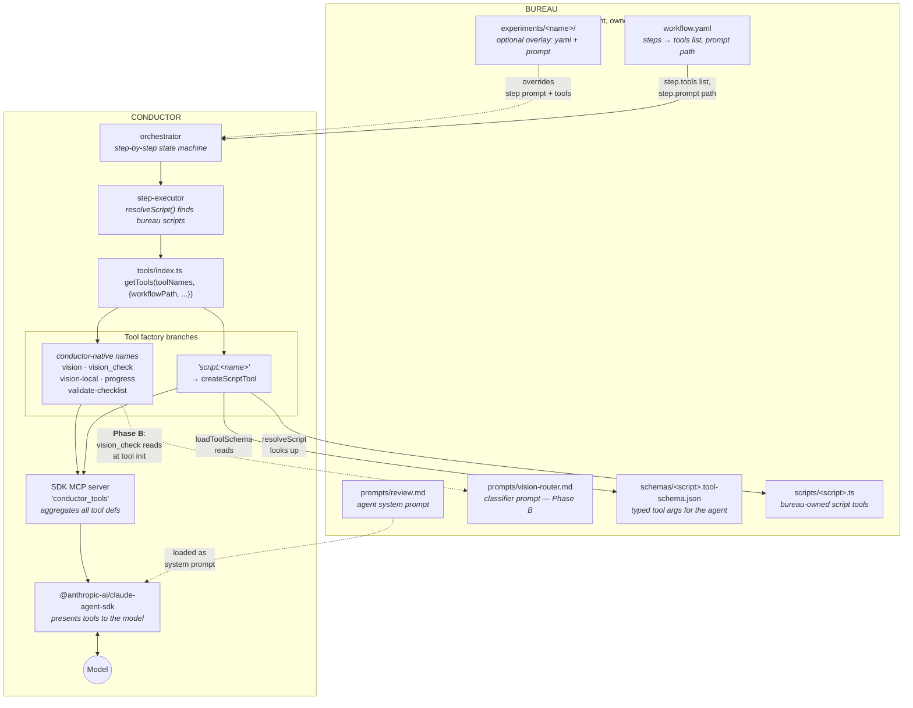

# Tool Scaffolding & Dispatching Architecture

How conductor exposes tools to the agent, where bureau fits in, and where
`vision_check` is positioned in the system. Reference for anyone building
or modifying tools — Phase B implementers especially.

## Two-repo split

Two repos cooperate to give the agent its toolbox:

- **conductor** — the engine. Runs workflows, hosts tool implementations,
  bridges to the model via the Claude Agent SDK. Generic across
  jurisdictions and disciplines.
- **bureau** — the content. Per-jurisdiction workflow definitions
  (YAML), prompts (Markdown), tool schemas (JSON Schema), and
  workflow-local script tools (TypeScript). Bureau is conductor's
  filesystem dependency at runtime.

Conductor doesn't know which checklist items exist, what the prompts
say, or which scripts to run — bureau owns all of that. Conductor knows
*how* to load and execute what bureau ships.

## High-level diagram



## How a tool gets registered

The single entry point is `conductor/src/tools/index.ts:getTools()`. It
takes the names of the tools the current step needs (from the
workflow YAML's `tools:` list) and returns an MCP server config the
Agent SDK can use.

```typescript
// Simplified: see src/tools/index.ts for the real thing
export function getTools(toolNames: string[], config: ToolsConfig): ToolsResult {
  const toolList = [];
  for (const name of toolNames) {
    if (name.startsWith('script:')) {
      const scriptName = name.slice('script:'.length);
      const resolved = resolveScript(scriptName, config.workflowPath);
      const toolSchema = loadToolSchema(config.workflowPath, scriptName);
      toolList.push(createScriptTool({ scriptName, ...resolved, toolSchema, ... }));
      continue;
    }
    switch (name.toLowerCase()) {
      case 'vision':              toolList.push(createVisionTool({...})); break;
      case 'vision_check':        toolList.push(createVisionCheckTool({...})); break;
      case 'vision-local':        toolList.push(createVisionLocalTool({...})); break;
      case 'validate-checklist':  toolList.push(createValidateChecklistTool({...})); break;
      case 'progress':            toolList.push(createProgressTool({...})); break;
    }
  }
  // Aggregate into one MCP server, return to the SDK.
}
```

Two flavors of tool live side-by-side:

| Flavor | Code lives in | Examples | Why this flavor |
|---|---|---|---|
| **Conductor-native MCP tools** | `conductor/src/tools/<name>/` or `<name>.ts` | `vision`, `vision_check`, `vision-local`, `validate-checklist`, `progress` | Generic across workflows / jurisdictions; benefit from the conductor TS ecosystem (gateway provider options, supabase client, etc.). |
| **Bureau script tools** | `bureau/jurisdictions/<j>/workflows/<w>/scripts/<name>.ts` | `inspect-drawing`, `measure-distance`, `semantic-search-blocks` | Per-workflow customizable; owned by domain experts; ship without a conductor release. |

Both end up as MCP tools to the agent — the agent doesn't see the
distinction. The choice is purely about where the implementation
lives and who owns iterating on it.

## How bureau is wired in

When conductor runs a workflow, it knows two paths:

- **`workspacePath`** — a runtime sandbox path (per workflow run) where
  outputs land. Per-call tool artifacts go under
  `workspacePath/output/<tool>-calls/<callId>/`.
- **`workflowPath`** — the bureau workflow directory for the active
  workflow (e.g. `bureau/jurisdictions/austin/workflows/completeness-check/`).
  Conductor reads everything bureau-side from this root.

Bureau-side files conductor consumes:

| Path | Read by | When | Purpose |
|---|---|---|---|
| `<workflow>/workflow.yaml` | orchestrator | step planning | Which steps run, in what order, with which tools and prompt. |
| `<workflow>/prompts/review.md` | step-executor | per-agent step | The agent's system prompt for that step. |
| `<workflow>/prompts/vision-router.md` | `createVisionCheckTool` (**Phase B**) | tool init | Classifier prompt + taxonomy + few-shot examples. |
| `<workflow>/schemas/<script>.tool-schema.json` | `loadToolSchema` | tool init | Typed JSON Schema for script-tool args. |
| `<workflow>/scripts/<script>.{ts,py}` | `resolveScript` | tool init | The script-tool's command. |
| `<workflow>/experiments/<name>/experiment.yaml` | orchestrator | when `--experiment=<name>` is passed | Overrides selected steps' prompt + tools list. |
| `<workflow>/experiments/<name>/review.md` | step-executor | same | Replacement prompt for the overridden step. |

The dotted lines in the diagram above show these load points.

## Experiment overlays

`bureau/.../experiments/<name>/experiment.yaml` lets you swap the
prompt and tools list for selected steps without touching the
production workflow. Existing examples:

- `completeness-check/experiments/inspect-drawing/` — adds
  `script:inspect-drawing` to the `review` step's tools list and swaps
  in a prompt that documents the tool.
- `review/experiments/measure-distance/` — same pattern for
  measure-distance.

Phase C of the vision-check initiative will add:

- `completeness-check/experiments/vision-check/` — replaces the agent's
  vision tool list with just `vision_check` + `script:semantic-search-blocks`.
- `review/experiments/vision-check/` — same for the review workflow.

## Where `vision_check` fits

`vision_check` is a conductor-native MCP tool (Phase A scaffold landed
in conductor#143). It's a thin wrapper:

```mermaid
sequenceDiagram
  autonumber
  participant Agent
  participant VC as vision_check<br/>(conductor MCP tool)
  participant CL as Classifier<br/>(Haiku 4.5 — Phase B)
  participant DI as dispatch.ts
  participant Spec as Specialist<br/>(vision/inspect-drawing/<br/>measure-distance)
  participant Art as output/vision-check-calls/<br/>&lt;callId&gt;/

  Agent->>VC: vision_check(checklistItemText, documentId, sheetNum?, regionHint?)
  Note over VC: generate callId,<br/>start metadata.json
  VC->>CL: classify(checklistItemText)
  CL-->>VC: { problem_type, reasoning, confidence }
  VC->>DI: dispatch(problem_type, inputs)
  DI->>Spec: route to specialist
  Spec-->>DI: { answer, evidence, ... }
  DI-->>VC: DispatchResult { answer, specialistCalled, success }
  VC->>Art: write metadata.json<br/>(inputs + classifier output + dispatch result)
  VC-->>Agent: text answer
```

**Phase A (current):** the classifier step is skipped; dispatch always
forwards to generic vision regardless of input. Per-call artifacts are
emitted with classifier fields stubbed null.

**Phase B (next):** classifier wired in; dispatch routes per
`problem_type`. `metadata.json.classifier.{modelId,promptCommitSha,output}`
populated.

**Phase C (after):** bureau experiment overlays activate `vision_check`
in cc + review workflows.

### The hybrid code/prompt split for vision_check

`vision_check` lives in conductor, but its taxonomy + few-shot examples
live in bureau (the same way script-tool schemas live in bureau today).
This is an explicit tradeoff captured in [`plan.md`](./plan.md):

- **Code in conductor** because the dispatch logic is generic across
  workflows (cc, review, future workflows) and benefits from being in
  the same TS ecosystem as the tools it dispatches to.
- **Prompt in bureau** because the taxonomy + few-shot examples are
  per-workflow (cc and review have different items, different examples)
  and need to evolve at the bureau cadence — not blocked on conductor
  releases.

Connection point: `createVisionCheckTool({ workflowPath, ... })` reads
`workflowPath/prompts/vision-router.md` at tool init. Mirrors how
`createScriptTool` reads `workflowPath/schemas/<script>.tool-schema.json`.

## Per-call artifact layout

Each tool that emits per-call artifacts uses a similar shape:

```
workspacePath/output/
├── inspect-drawing-calls/
│   └── 20260504T182142Z-mzfa-run-1-cc-13/
│       ├── metadata.json
│       ├── prompt.txt
│       ├── cropped.jpg
│       └── response.txt
├── measure-distance-calls/
│   └── 20260423T211545Z-9psr-run-2-13-p0/   # batched: -p<N> per object pair
│       ├── metadata.json
│       ├── call1-cropped.jpg
│       └── call2-cropped.jpg
└── vision-check-calls/                       # added in Phase A (conductor#143)
    └── <callId>/
        └── metadata.json                     # Phase B adds classifier.txt + events.jsonl
```

`metadata.json` is the cross-tool ground truth — has `callId`,
`runIndex`, `applicableChecklistItems`, inputs, and the specialist's
result. The rigorous-metrics analysis pipeline reads from this layer.

## Glossary of important paths

| Path | What |
|---|---|
| `conductor/src/tools/index.ts` | Tool registry / `getTools()` entry point |
| `conductor/src/tools/script.ts` | `createScriptTool` — bureau script-tool wrapper |
| `conductor/src/tools/tool-schema-loader.ts` | `loadToolSchema` — reads bureau schemas |
| `conductor/src/orchestrator/step-executor.ts` | `resolveScript` — looks up bureau scripts |
| `conductor/src/tools/vision/` | Generic vision MCP tool |
| `conductor/src/tools/vision-check/` | **vision_check** orchestrator (Phase A scaffold) |
| `conductor/src/shared/vision-file.ts` | Shared helper for sheet/document fetch (used by vision + vision-check dispatch) |
| `bureau/jurisdictions/austin/workflows/<w>/workflow.yaml` | Per-workflow step config |
| `bureau/.../<w>/prompts/review.md` | Agent system prompt |
| `bureau/.../<w>/prompts/vision-router.md` | Classifier prompt (**Phase B**) |
| `bureau/.../<w>/schemas/` | Per-script tool schemas |
| `bureau/.../<w>/scripts/` | Per-workflow script tools |
| `bureau/.../<w>/experiments/<name>/` | Step-override overlays |

## Related design docs

- [`plan.md`](./plan.md) — full vision-check design + 4-phase execution plan
- [`problem-statement.md`](./problem-statement.md) — current hit-rate motivation
- [`../inspect-drawing-tool/ai-loop-exploration.md`](../inspect-drawing-tool/ai-loop-exploration.md) — sibling exploration into agentic loops *inside* a single specialist (complementary to this routing-layer work)
- `conductor/docs/structured-events.md` — event-logging conventions used by all tools
